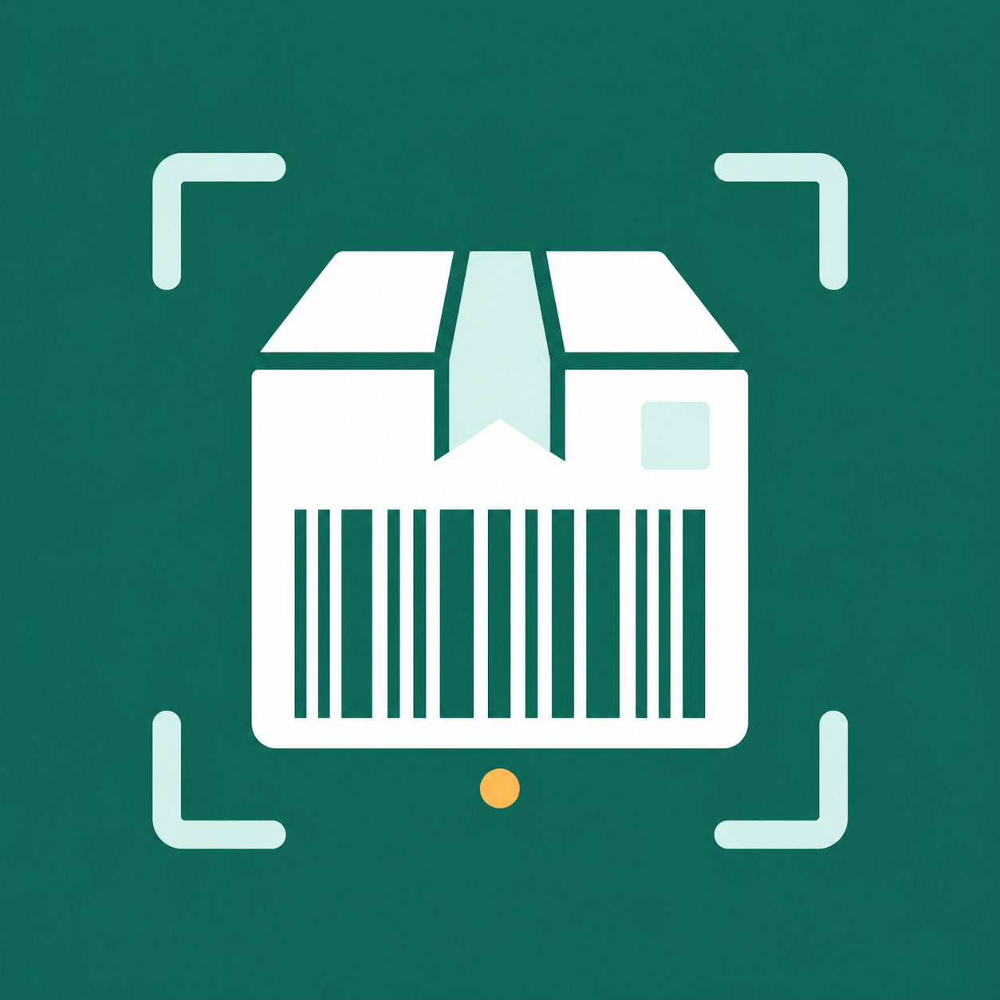
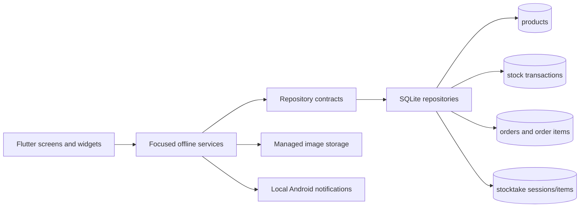

<div align="center">



# StockLens

### Scan. Find. Manage.

An offline-first barcode inventory system built specifically for Android.

<p>
  
  
  
  
  
  
</p>

</div>

---

## Overview

StockLens turns an Android phone into a local inventory terminal. Scan a retail
barcode to retrieve a product, register unknown products, run stocktakes,
receive per-product low-stock alerts, review local reports, and import inventory
through previewed CSV upserts—without requiring a server or internet connection.

```text
SCAN                       FIND                       MANAGE
Camera or manual code  ->  Local SQLite lookup  ->  View, edit, or adjust stock
                                    |
                                    +-> Unknown code? Create a product
```

## Highlights

| Capability | What it provides |
| --- | --- |
| Barcode scanning | Guided camera scanner, flashlight, camera switching, haptics, sound, and duplicate-scan protection |
| Point of sale | Scanner/manual checkout, stock-aware cart quantities, atomic inventory deductions, and centavo-safe totals |
| Sales history | Date-grouped orders with expandable product, quantity, price, and subtotal snapshots |
| Product catalog | Names, barcodes, cost and selling prices, thresholds, categories, descriptions, stock, and managed images |
| Auditable stock | Atomic adjustments with reasons, notes, before-and-after quantities, and timestamps |
| Stocktake | Resumable full, category, or selected-product counts with atomic reconciliation |
| Low-stock alerts | Per-product thresholds, an in-app alert center, and optional local Android notifications |
| Offline reports | Inventory valuation, profitability, movement, fast movers, and inactive stock by date range |
| Fast inventory | Search by name, barcode, or category with filters and seven sorting modes |
| Recovery | Product archive, restore, and separately confirmed permanent deletion |
| Portable data | Complete JSON backup/restore, CSV export, and previewed atomic CSV upserts |
| Offline operation | Local SQLite storage with no account, server, or network dependency |
| Android delivery | Automated checks, installable APKs, signed AAB support, checksums, and build manifests |

## Product experience

### Dashboard

- Product and low-stock totals
- Quick actions for scanning, searching, inventory, and product creation
- Material 3 interface with large touch targets
- Persistent navigation for the primary workflows

### Scanner

- Common retail-barcode detection through `mobile_scanner`
- Camera overlay, tap-to-focus, flashlight, and camera switching
- Manual barcode entry for damaged or unreadable labels
- Haptic and sound feedback after camera detection
- Known-product navigation and unknown-product creation flow
- Friendly permission-denied and camera-start error states

### Inventory

- Live search across product name, barcode, and category
- Category filtering
- Name, price, stock, and creation-date sorting
- Philippine Peso formatting
- Separate cost and selling prices with potential margin visibility
- Per-product low-stock thresholds
- Clear in-stock, low-stock, and out-of-stock badges
- Permanent app-managed product photos

### Point of sale

- Camera scanning and manual barcode/SKU entry
- Duplicate scans increase cart quantity without creating duplicate lines
- Available-stock enforcement during cart editing and checkout revalidation
- Atomic order creation, line-item snapshots, inventory deductions, and stock audit entries
- Philippine Peso totals stored as integer centavos
- Date-grouped, expandable sales and order history

### Stocktake and alerts

- Create full-inventory, category, or individually selected stocktakes
- Autosave counts, resume interrupted sessions, and increment counts by barcode
- Review variances and concurrent stock changes before atomic reconciliation
- Per-product low-stock rules, including threshold zero for out-of-stock-only alerts
- In-app alerts that work without notification permission
- Optional Android notifications triggered by threshold crossings from manual,
  stocktake, CSV, and product-threshold changes

### Reports

- Today, 7-day, 30-day, custom, and all-time date ranges
- Current units, cost value, retail value, potential margin, low stock, and out of stock
- Recorded sales revenue, cost, estimated gross profit, damage, expiry, and net movement
- Category valuation, fast movers, and stocked products without movement
- Transparent disclosure when legacy sales lack historical price snapshots

### CSV import

- One strict UTF-8 `.csv` file up to 20 MB
- Case-insensitive headers and legacy `price` alias support
- Barcode-based new products and partial updates with exact trimmed matching
- Preview groups for new products, detail updates, stock changes, unchanged rows,
  and blocking errors
- Blank existing quantity preserves stock; explicit zero reconciles it to zero
- Archived conflicts and stale previews block the entire operation
- Every accepted import is atomic and its stock corrections share one audit ID

### Stock history

- Restock, sale, damage, expiry, correction, and custom reasons
- Optional notes, with a required explanation for `Other`
- Previous quantity, resulting quantity, delta, and timestamp
- Negative-stock protection
- Atomic database writes so quantity and history cannot diverge
- Read-only quantity during ordinary product editing

### Data safety

- Archive and restore without losing product history
- Permanent deletion available only for archived products
- Portable version-2 JSON backups containing products, images, archive state,
  price snapshots, stock history, sales orders/items, stocktake sessions, and
  stocktake items, with compatibility for both earlier version-2 backup shapes
- Transactional restore with format validation
- CSV sharing for active and archived inventory, including cost/selling prices and thresholds
- Tested database migration from schema versions 1 and 2, plus both legacy
  version-3 layouts, to the reconciled version-4 schema

## Architecture

StockLens separates Flutter screens, business rules, and persistence. UI code
does not execute SQL directly.



This repository boundary keeps a future synchronized implementation possible
without coupling the interface to HTTP or a particular backend.

```text
lib/
|-- core/                 Theme, formatting, and shared async UI
|-- data/local/           SQLite schema and migrations
|-- models/               Products and stock transactions
|-- repositories/         Persistence contract and SQLite implementation
|-- services/             Business rules, images, backup, and export
|-- screens/              Android application workflows
`-- widgets/              Reusable presentation components
```

## Technology

| Layer | Technology |
| --- | --- |
| UI | Flutter, Dart, Material 3 |
| Local database | SQLite through `sqflite` |
| Barcode scanning | `mobile_scanner` |
| Product images | `image_picker`, `path_provider` |
| Backup, CSV, and sharing | `file_picker`, `csv`, `share_plus` |
| Local notifications | `flutter_local_notifications` |
| Testing | Flutter Test, `sqflite_common_ffi` |
| Android build | Gradle, Android SDK/NDK, PowerShell helpers |
| Automation | GitHub Actions |

## Requirements

- Windows, macOS, or Linux development computer
- Flutter 3.44.0 or a compatible stable release
- Android Studio and Android SDK
- Android SDK Command-line Tools
- Android device or emulator for running the application
- Windows Developer Mode or an elevated terminal when Flutter plugins require
  symbolic-link support

Check the environment:

```powershell
flutter doctor -v
flutter pub get
flutter analyze
flutter test
```

## Run on Android

Connect an Android phone with USB debugging enabled or start an emulator, then:

```powershell
.\tools\run_stocklens.ps1
```

Pass a specific device ID when more than one Android target is connected:

```powershell
.\tools\run_stocklens.ps1 -Device <android-device-id>
```

The launcher restores packages unless `-SkipPubGet` is supplied and forwards
remaining arguments to `flutter run`.

## Build Android packages

Run the interactive packaging assistant:

```powershell
.\tools\build_stocklens.ps1
```

It can produce:

- A universal APK for direct installation
- Smaller per-architecture APKs
- An Android App Bundle for Play Console
- Debug, profile, or signed release artifacts
- Optional Dart obfuscation and separated debug symbols
- SHA-256 checksums and a JSON build manifest

Automated signed release APK and App Bundle:

```powershell
.\tools\build_stocklens.ps1 `
  -NonInteractive `
  -Format apk `
  -Mode release `
  -VersionName 0.3.0 `
  -BuildNumber 4 `
  -ApplicationId com.jrpbone.stocklens `
  -SkipChecks

.\tools\build_stocklens.ps1 `
  -NonInteractive `
  -Format appbundle `
  -Mode release `
  -VersionName 0.3.0 `
  -BuildNumber 4 `
  -ApplicationId com.jrpbone.stocklens `
  -SkipChecks
```

Release builds require the private local upload key and never fall back to the
debug certificate. Run `tools/setup_android_signing.ps1` to configure the
ignored local signing files before producing an AAB.

## Continuous integration

The Android workflow runs on pushes, pull requests, and manual dispatches. It:

1. Restores Flutter packages.
2. Checks Dart formatting.
3. Runs static analysis.
4. Runs automated tests.
5. Builds an installable debug APK.
6. Publishes the APK and its SHA-256 checksum for 14 days.

Release credentials are intentionally absent from public CI.

## Verification status

| Check | Result |
| --- | :---: |
| Dart formatting | Passed |
| Flutter analyzer | No issues |
| Automated tests | 139 passed |
| SQLite v1/v2 and both legacy v3 layouts to v4 | Covered |
| Stock history and rollback | Covered |
| Stocktake, alerts, reports, and CSV import | Covered |
| Archive, restore, and deletion | Covered |
| Cross-feature backup and restore | Covered |
| Signed Android release APK and AAB | Built and manifests verified |
| Camera scanning on a physical Android phone | Validated by project owner |

## Current release

The current release is **v0.3.0** (`0.3.0+4`). See
[CHANGELOG.md](CHANGELOG.md) for the complete release history.

## Current limitations

- Inventory remains local to one Android device unless backups are transferred
  manually.
- Authentication and role-based permissions are not included.
- Stock transactions do not yet record an authenticated user.
- Cloud synchronization, recurring background processing, and multi-location
  inventory are not implemented. Low-stock notifications are local to Android.
- Signed release credentials exist only on configured development machines and
  must be backed up separately.

## Contributing

Before submitting a change:

1. Keep UI, business rules, and persistence concerns separated.
2. Add or update tests for behavioral changes.
3. Run formatting, analysis, and tests.
4. Update the changelog for user-visible changes.
5. Never commit release signing files or exported inventory data.
