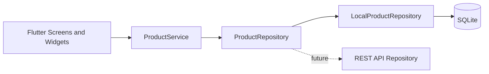

<div align="center">

---

## Overview

StockLens turns an Android phone into a simple inventory terminal. Scan a retail barcode to retrieve a product instantly, register unknown products without retyping the barcode, search the catalog manually, and keep stock quantities accurate - all without a server connection.

```text
            SCAN                 FIND                 MANAGE
      Point at barcode  -->  Match local product  -->  View or adjust stock
                                      |
                                      +--> Unknown? Create a new product
```

> [!NOTE]
> StockLens v0.1.0 is an offline-first MVP. Products are stored locally on the device and the repository boundary is ready for a future REST API.

## Highlights

|              | Capability                    | What it delivers                                                                                                   |
| :----------: | ----------------------------- | ------------------------------------------------------------------------------------------------------------------ |
| **01** | **Instant scanning**    | Camera-based barcode detection with a guided overlay, flashlight, camera switching, and duplicate-scan protection. |
| **02** | **Complete catalog**    | Add and edit product names, barcodes, prices, categories, descriptions, quantities, and images.                    |
| **03** | **Smart inventory**     | Search, category filters, seven sort modes, stock quantities, and clear availability badges.                       |
| **04** | **Fast lookup**         | Live search across product name, barcode, and category without opening the scanner.                                |
| **05** | **Safe stock updates**  | Add or remove stock with a reason while preventing quantities from becoming negative.                              |
| **06** | **Offline persistence** | SQLite storage, unique barcode enforcement, and first-run sample data with no backend required.                    |

### Core workflows

<table>
  <tr>
    <td width="33%" valign="top">
      <h4>Scan a product</h4>
      <p>Align a barcode in the camera frame. Known products open immediately; unknown codes flow directly into product creation.</p>
    </td>
    <td width="33%" valign="top">
      <h4>Manage inventory</h4>
      <p>Browse the catalog, filter by category, sort by stock or price, and open any item for complete details.</p>
    </td>
    <td width="33%" valign="top">
      <h4>Control stock</h4>
      <p>Record restocks, sales, damage, expiry, corrections, or other adjustments without allowing negative stock.</p>
    </td>
  </tr>
</table>

## Product experience

### Dashboard

- Branded Material 3 home screen with large touch targets
- Product and low-stock totals at a glance
- Quick access to Scan, Search, Inventory, and Add Product
- Persistent bottom navigation for the four primary destinations

### Barcode scanner

- Live camera preview using `mobile_scanner`
- Guided scan frame with tap-to-focus
- Flashlight and camera switching controls
- Cooldown that suppresses rapid duplicate detections
- Automatic local product lookup
- Product Details navigation for known codes
- Add Product prompt with automatic barcode insertion for unknown codes
- Friendly permission-denied and camera-start error states

### Product management

- Required barcode and product-name validation
- Non-negative numeric price validation
- Non-negative integer quantity validation
- Unique barcode enforcement in SQLite and the repository
- Warning before an existing barcode is changed
- Optional image selection from the photo library
- Philippine Peso display formatting

### Inventory and search

- Live matching by name, barcode, or category
- Category filtering
- Sort by:
  - Product Name A-Z
  - Product Name Z-A
  - Price Low to High
  - Price High to Low
  - Lowest Stock
  - Highest Stock
  - Newest

### Stock states

| Quantity | Badge                  | Meaning                  |
| :------: | ---------------------- | ------------------------ |
|  `0`  | **Out of Stock** | No sellable units remain |
| `1-5` | **Low Stock**    | Reordering may be needed |
|  `6+`  | **In Stock**     | Normal availability      |

## Architecture

StockLens keeps interface, business rules, and persistence separate. Screens never execute SQL directly.



This makes the current local repository replaceable without rewriting the product screens.

<details>
<summary><strong>View project structure</strong></summary>

```text
lib/
|-- main.dart
|-- app.dart
|-- core/
|   |-- theme/
|   |-- utils/
|   `-- widgets/
|-- data/
|   `-- local/
|-- models/
|-- repositories/
|-- services/
|-- screens/
|   |-- add_product/
|   |-- edit_product/
|   |-- home/
|   |-- inventory/
|   |-- product_details/
|   |-- scanner/
|   |-- search/
|   `-- stock_adjustment/
`-- widgets/
```

</details>

### Data flow

```text
User action
    |
Flutter UI
    |
ProductService           validation and business operations
    |
ProductRepository        replaceable persistence contract
    |
LocalProductRepository   SQLite queries and error translation
    |
stocklens.db
```

### Product model

Every product includes:

```dart
String id;
String barcode;
String name;
double price;
String category;
String description;
int quantity;
String? imagePath;
DateTime createdAt;
DateTime updatedAt;
```

The model supports `fromJson`, `toJson`, and immutable updates through `copyWith`, including explicit nullable image updates.

## Technology

| Technology                                                   | Role                                        |
| ------------------------------------------------------------ | ------------------------------------------- |
| [Flutter](https://flutter.dev)                                | Cross-platform UI and Material 3 experience |
| [Dart](https://dart.dev)                                      | Null-safe application language              |
| [`sqflite`](https://pub.dev/packages/sqflite)               | Local SQLite persistence                    |
| [`mobile_scanner`](https://pub.dev/packages/mobile_scanner) | Camera barcode detection                    |
| [`image_picker`](https://pub.dev/packages/image_picker)     | Product image selection                     |
| [`intl`](https://pub.dev/packages/intl)                     | Philippine Peso formatting                  |
| [`uuid`](https://pub.dev/packages/uuid)                     | Local product identifiers                   |
| [`path`](https://pub.dev/packages/path)                     | Portable database paths                     |

## Quick start

### Prerequisites

- Flutter 3.44.0 or newer
- Dart 3.12.0 or newer
- Android SDK and an Android toolchain
- A physical Android device or camera-capable emulator
- Git

### Run locally

```bash
# Clone or download this repository, then open its directory.
cd StockLens
flutter pub get
flutter run
```

> [!TIP]
> A physical Android device provides the most reliable barcode-scanner test. Grant camera permission when StockLens asks for it.

### Windows setup

Flutter plugins require symbolic-link support on Windows. Enable **Developer Mode** if Flutter reports that symlink support is unavailable.

Both PowerShell assistants test symbolic-link creation before invoking Flutter. When support is unavailable, they can open the correct Windows Settings page and pause until Developer Mode has been enabled.

This requirement is entirely local to Windows and does not connect to a phone. An Administrator PowerShell window can also provide symbolic-link permission if Developer Mode is not desired.

StockLens includes a PowerShell launcher that restores packages and starts the application from the correct project directory:

```powershell
.\run_stocklens.ps1
```

Select a specific Flutter device or emulator:

```powershell
.\run_stocklens.ps1 -Device <device-id>
```

Skip package restoration and forward additional options to `flutter run`:

```powershell
.\run_stocklens.ps1 -SkipPubGet --debug
```

Use `flutter devices` to find available device IDs. If Windows blocks local scripts, run the launcher for the current session with:

```powershell
powershell -ExecutionPolicy Bypass -File .\run_stocklens.ps1
```

Developer Mode is a one-time Windows configuration. It can also be opened manually with:

```powershell
start ms-settings:developers
```

### Android configuration

Camera permission and the optional-camera feature are already declared in `android/app/src/main/AndroidManifest.xml`. Configure a valid Android SDK before building:

```bash
flutter doctor
flutter build apk --debug
```

iOS camera and photo-library usage descriptions are also present in `ios/Runner/Info.plist` for future platform validation.

## Development

Run the complete quality gate before submitting a change:

```bash
dart format --output=none --set-exit-if-changed lib test
flutter analyze
flutter test
```

### Interactive build assistant

Use the PowerShell build assistant to collect and validate application metadata before creating a package:

```powershell
.\build_stocklens.ps1
```

The assistant prompts for:

- Application display name and Android application ID
- Semantic version and positive build number
- APK or Android App Bundle output
- Debug, profile, or release mode
- Clean build, dependency restoration, analysis, and tests
- Release obfuscation and per-ABI APK splitting
- Final confirmation before any build begins

Build artifacts are copied into a versioned `dist/` directory with a SHA-256 checksum and `build-manifest.json`. Prompted app-name and application-ID changes are embedded in the artifact temporarily; the project source files are restored when the build completes or fails.

The build assistant only creates package files. It does not enumerate, connect to, or install anything on a phone.

For automation, pass metadata non-interactively:

```powershell
.\build_stocklens.ps1 `
  -NonInteractive `
  -Format apk `
  -Mode release `
  -VersionName 0.1.0 `
  -BuildNumber 1 `
  -AppName StockLens `
  -ApplicationId com.example.stocklens `
  -Obfuscate
```

> [!WARNING]
> The current Android release configuration uses the debug signing key. The assistant reports this during release builds, but a production keystore must be configured before Play Store distribution.

### v0.1.0 verification

| Check                          |                       Result                       |
| ------------------------------ | :------------------------------------------------: |
| Flutter analyzer               |             **No issues found**             |
| Automated tests                |                 **2 passed**                 |
| Product JSON round-trip        |                 **Covered**                 |
| Nullable product image updates |                 **Covered**                 |
| Dashboard widget smoke test    |                 **Covered**                 |
| Android debug APK              | **Blocked locally: Android SDK unavailable** |
| Physical-device scanner test   |                 **Pending**                 |

## Sample inventory

The local database seeds these products only when it is empty:

| Product                |        Price | Category      | Initial stock |
| ---------------------- | -----------: | ------------- | ------------: |
| Coca-Cola 1.5L         | &#8369;75.00 | Beverages     |            20 |
| Lucky Me Pancit Canton | &#8369;18.00 | Food          |            50 |
| Safeguard Soap         | &#8369;45.00 | Personal Care |            10 |
| Century Tuna           | &#8369;42.00 | Canned Goods  |             4 |

## Release

The current release is **v0.1.0** (`0.1.0+1`) - the initial functional MVP.

Read the complete release record in [CHANGELOG.md](CHANGELOG.md).

## Roadmap

The complete prioritized product and engineering backlog is maintained in [TODO.md](TODO.md).

### Now - v0.1.0

- [X] Offline SQLite product catalog
- [X] Barcode scanning and lookup
- [X] Product create and edit workflows
- [X] Inventory search, filters, and sorting
- [X] Stock adjustment with negative-stock protection
- [X] Product image selection

### Next

- [ ] Configure Android CI and produce installable APK artifacts
- [ ] Validate scanning and permissions on physical Android devices
- [ ] Persist stock transaction history and adjustment reasons
- [ ] Add product deletion with confirmation and recovery strategy
- [ ] Move selected product images into permanent app storage

### Later

- [ ] Authentication with admin and employee roles
- [ ] REST API and cloud synchronization
- [ ] Audit logs, sales tracking, and low-stock notifications
- [ ] Category, supplier, store, and branch management
- [ ] Customer price-check mode
- [ ] CSV/PDF exports, inventory reports, and dashboard statistics
- [ ] Expanded QR code workflows

## Current limitations

- Inventory is local to one device and is not synchronized.
- Product images currently reference local device files.
- Adjustment reasons are selected in the interface but transaction history is not persisted yet.
- Authentication and role-based authorization are not included.
- Product deletion is not available in v0.1.0.
- Barcode scanning still needs physical-device validation.

## Contributing

Contributions, bug reports, and feature proposals are welcome. Before opening a pull request:

1. Keep UI, business logic, and persistence concerns separated.
2. Add or update tests for behavior changes.
3. Run formatting, analysis, and tests locally.
4. Document user-visible changes in `CHANGELOG.md`.

---

<div align="center">
